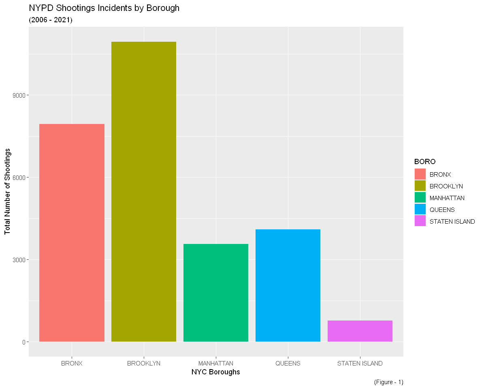
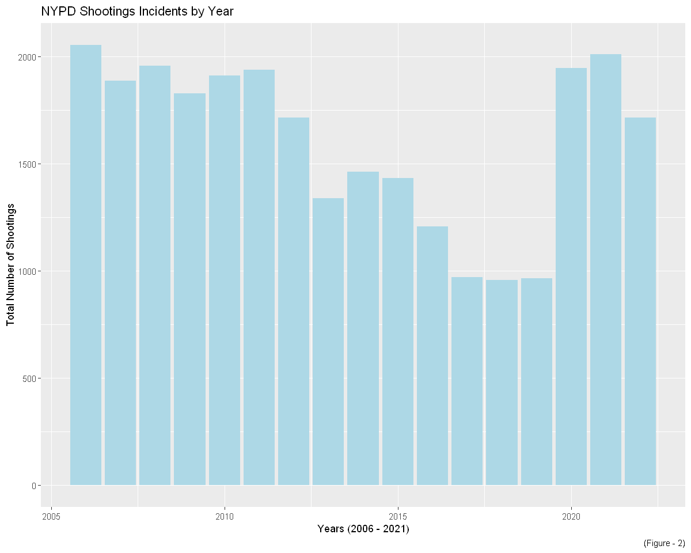
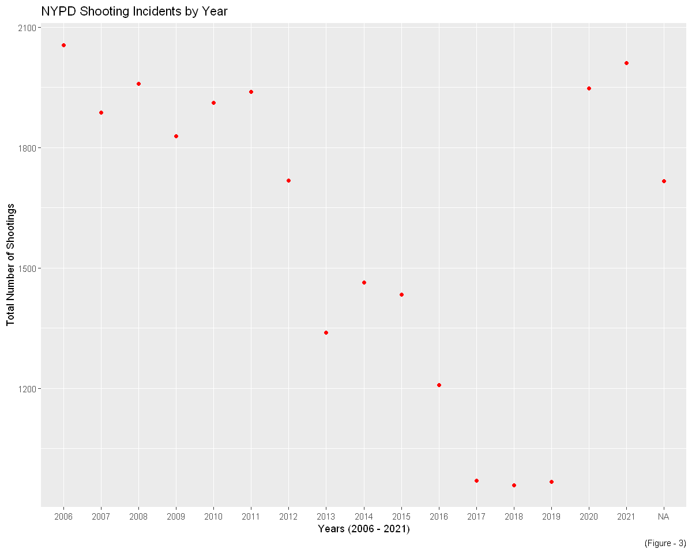
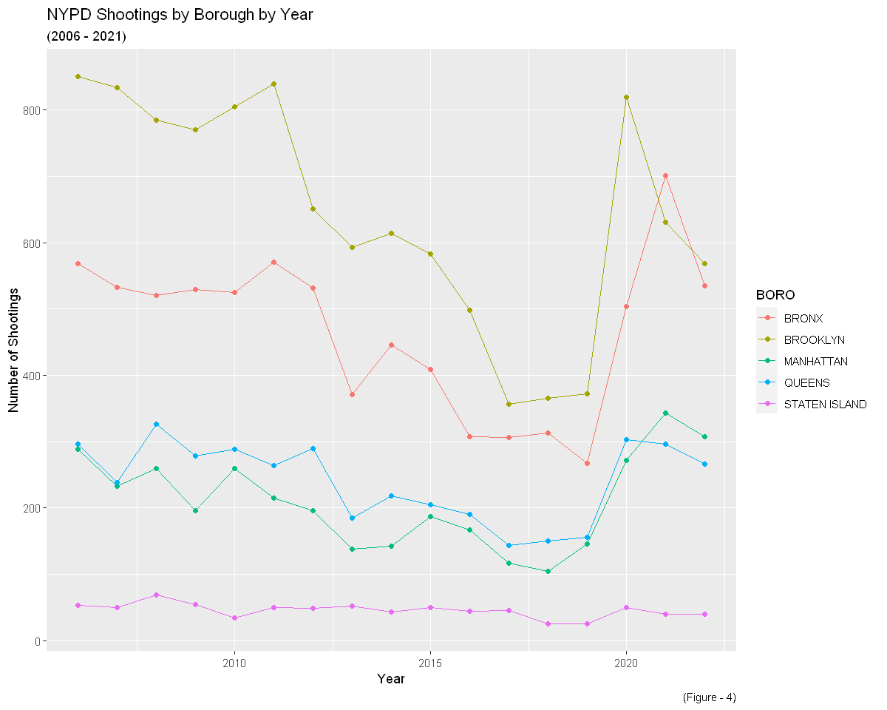
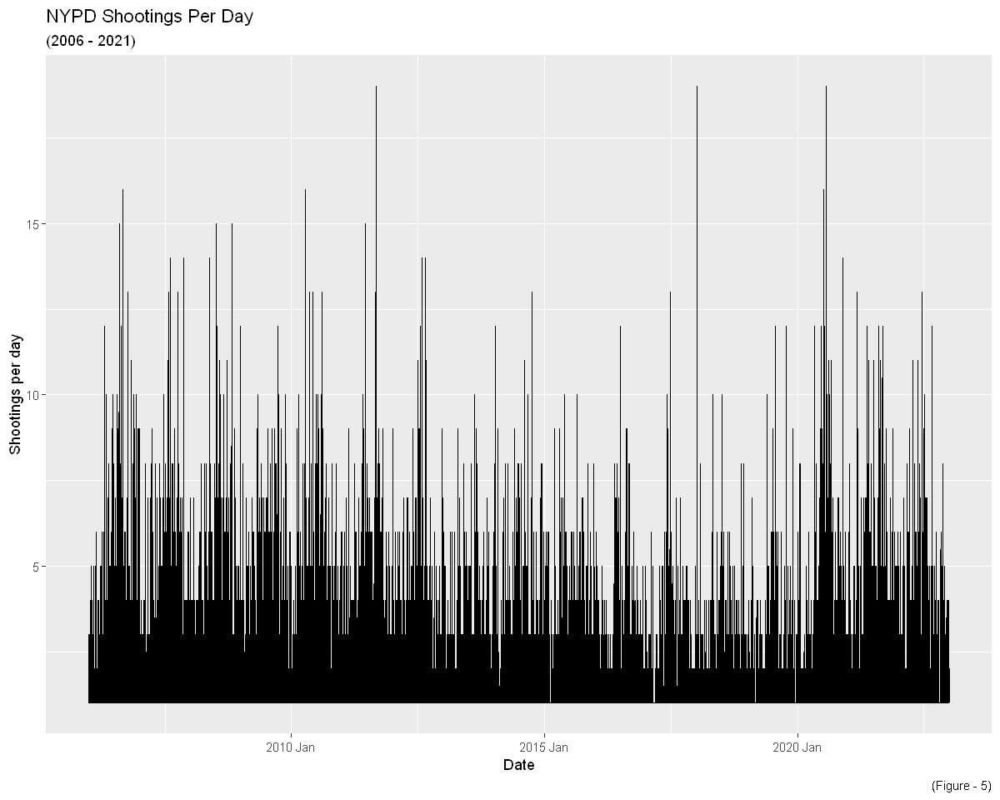
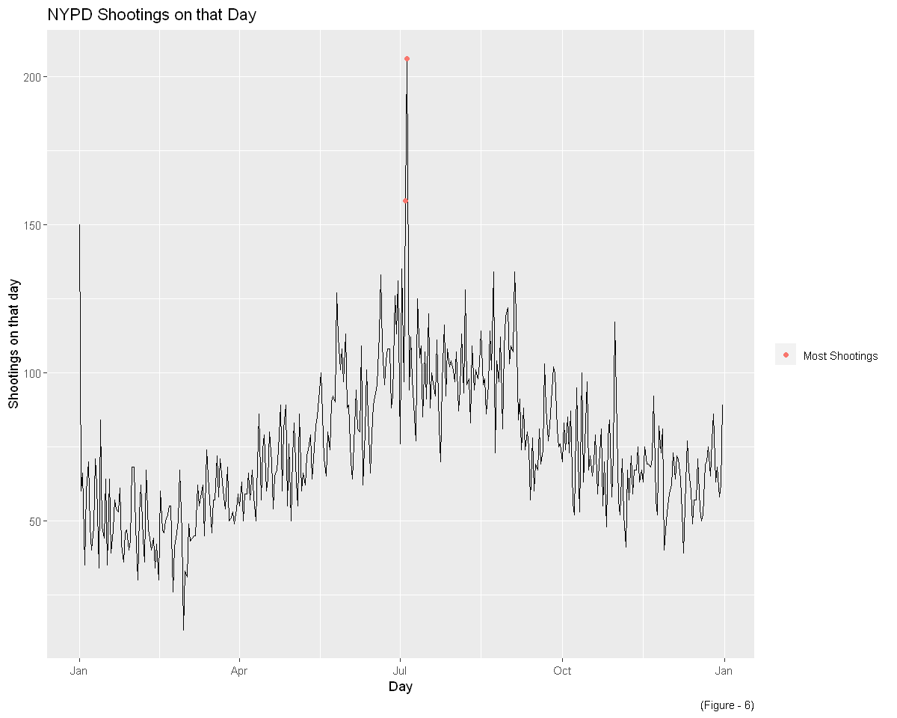
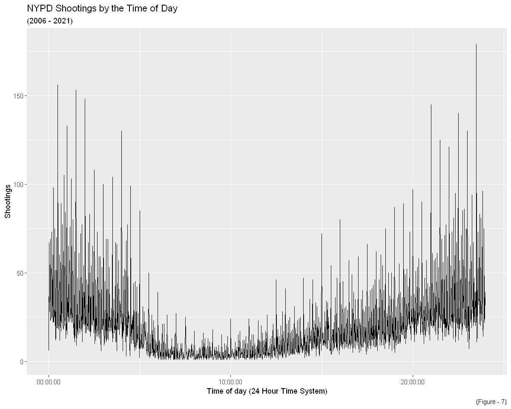
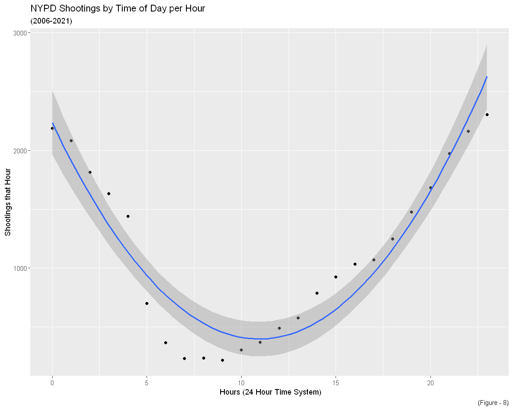
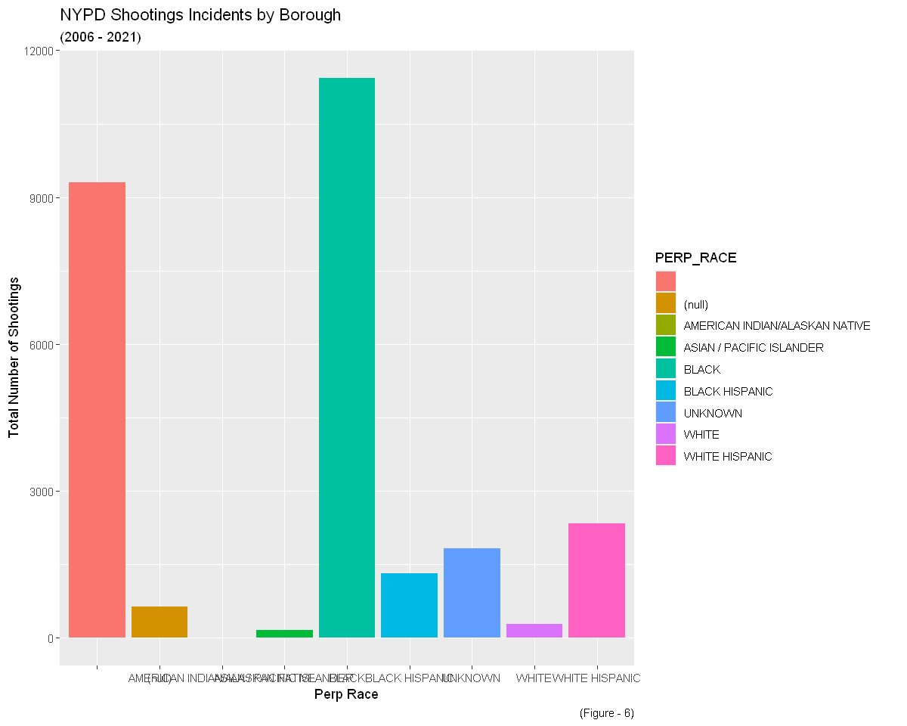

---
jupyter:
  kernelspec:
    display_name: R
    language: R
    name: ir
  language_info:
    codemirror_mode: r
    file_extension: .r
    mimetype: text/x-r-source
    name: R
    pygments_lexer: r
    version: 4.1.3
  nbformat: 4
  nbformat_minor: 5
  toc:
    base_numbering: 1
    nav_menu: {}
    number_sections: true
    sideBar: true
    skip_h1_title: true
    title_cell: Table of Contents
    title_sidebar: Contents
    toc_cell: false
    toc_position: {}
    toc_section_display: true
    toc_window_display: false
---

::: {#5a92744b .cell .markdown}
# Loading libraries
:::

::: {#77cf84ff .cell .code execution_count="10" ExecuteTime="{\"end_time\":\"2024-03-16T15:50:36.654416Z\",\"start_time\":\"2024-03-16T15:50:36.629Z\"}"}
``` R
library(tidyverse)
library(lubridate)
library(ggplot2)
library(repr)
options(repr.plot.width=10, repr.plot.height=8)
```
:::

::: {#0028f922 .cell .markdown}
# Loading Data
:::

::: {#a488baf4 .cell .code execution_count="2" ExecuteTime="{\"end_time\":\"2024-03-16T15:49:49.333636Z\",\"start_time\":\"2024-03-16T15:49:32.780Z\"}"}
``` R
url_NYPD <- "https://data.cityofnewyork.us/api/views/833y-fsy8/rows.csv?accessType=DOWNLOAD"
NYPD <- read.csv(url_NYPD)
```
:::

::: {#b2e5197f .cell .markdown}
# EDA

Let us start with simple EDA
:::

::: {#9807600d .cell .code execution_count="3" ExecuteTime="{\"end_time\":\"2024-03-16T15:49:49.397610Z\",\"start_time\":\"2024-03-16T15:49:33.862Z\"}" scrolled="false"}
``` R
head(NYPD, 10)
```

::: {.output .display_data}

A data.frame: 10 × 21

| <!--/--> | INCIDENT_KEY &lt;int&gt; | OCCUR_DATE &lt;chr&gt; | OCCUR_TIME &lt;chr&gt; | BORO &lt;chr&gt; | LOC_OF_OCCUR_DESC &lt;chr&gt; | PRECINCT &lt;int&gt; | JURISDICTION_CODE &lt;int&gt; | LOC_CLASSFCTN_DESC &lt;chr&gt; | LOCATION_DESC &lt;chr&gt; | STATISTICAL_MURDER_FLAG &lt;chr&gt; | ⋯ ⋯ | PERP_SEX &lt;chr&gt; | PERP_RACE &lt;chr&gt; | VIC_AGE_GROUP &lt;chr&gt; | VIC_SEX &lt;chr&gt; | VIC_RACE &lt;chr&gt; | X_COORD_CD &lt;dbl&gt; | Y_COORD_CD &lt;dbl&gt; | Latitude &lt;dbl&gt; | Longitude &lt;dbl&gt; | Lon_Lat &lt;chr&gt; |
|---|---|---|---|---|---|---|---|---|---|---|---|---|---|---|---|---|---|---|---|---|---|
| 1 | 228798151 | 05/27/2021 | 21:30:00 | QUEENS   | <!----> | 105 | 0 | <!----> | <!----> | false | ⋯ | <!----> | <!----> | 18-24 | M | BLACK          | 1058925 | 180924.0 | 40.66296 | -73.73084 | POINT (-73.73083868899994 40.662964620000025) |
| 2 | 137471050 | 06/27/2014 | 17:40:00 | BRONX    | <!----> |  40 | 0 | <!----> | <!----> | false | ⋯ | <!----> | <!----> | 18-24 | M | BLACK          | 1005028 | 234516.0 | 40.81035 | -73.92494 | POINT (-73.92494232599995 40.81035186300006)  |
| 3 | 147998800 | 11/21/2015 | 03:56:00 | QUEENS   | <!----> | 108 | 0 | <!----> | <!----> | true  | ⋯ | <!----> | <!----> | 25-44 | M | WHITE          | 1007668 | 209836.5 | 40.74261 | -73.91549 | POINT (-73.91549174199997 40.74260663300004)  |
| 4 | 146837977 | 10/09/2015 | 18:30:00 | BRONX    | <!----> |  44 | 0 | <!----> | <!----> | false | ⋯ | <!----> | <!----> | &lt;18   | M | WHITE HISPANIC | 1006537 | 244511.1 | 40.83778 | -73.91946 | POINT (-73.91945661499994 40.83778200300003)  |
| 5 |  58921844 | 02/19/2009 | 22:58:00 | BRONX    | <!----> |  47 | 0 | <!----> | <!----> | true  | ⋯ | M | BLACK | 45-64 | M | BLACK          | 1024922 | 262189.4 | 40.88624 | -73.85291 | POINT (-73.85290950899997 40.88623791800006)  |
| 6 | 219559682 | 10/21/2020 | 21:36:00 | BROOKLYN | <!----> |  81 | 0 | <!----> | <!----> | true  | ⋯ | <!----> | <!----> | 25-44 | M | BLACK          | 1004234 | 186461.7 | 40.67846 | -73.92795 | POINT (-73.92795224099996 40.678456718000064) |
| 7 |  85295722 | 06/17/2012 | 22:47:00 | QUEENS   | <!----> | 114 | 0 | <!----> | <!----> | false | ⋯ | <!----> | <!----> | 25-44 | M | BLACK          |  998860 | 214885.0 | 40.75648 | -73.94727 | POINT (-73.94726649399996 40.75648234300007)  |
| 8 |  71662474 | 03/08/2010 | 19:41:00 | BROOKLYN | <!----> |  81 | 0 | <!----> | <!----> | true  | ⋯ | <!----> | <!----> | 18-24 | M | BLACK          | 1002883 | 192219.7 | 40.69426 | -73.93281 | POINT (-73.93280863699994 40.694264056000065) |
| 9 |  83002139 | 02/05/2012 | 05:45:00 | QUEENS   | <!----> | 105 | 0 | <!----> | <!----> | false | ⋯ | <!----> | <!----> | 25-44 | M | BLACK          | 1054366 | 196628.4 | 40.70611 | -73.74711 | POINT (-73.74710653899996 40.706106731000034) |
| 10 |  86437261 | 08/26/2012 | 01:10:00 | QUEENS   | <!----> | 101 | 0 | <!----> | MULTI DWELL - APT BUILD | false | ⋯ | M | BLACK | 25-44 | M | BLACK          | 1053937 | 157130.4 | 40.59770 | -73.74906 | POINT (-73.74906464199995 40.59769719800005)  |
:::
:::

::: {#9615ce55 .cell .markdown}
There seems to be a lot of blanks
:::

::: {#c4ab8b73 .cell .code execution_count="4" ExecuteTime="{\"end_time\":\"2024-03-16T15:49:49.429617Z\",\"start_time\":\"2024-03-16T15:49:34.900Z\"}"}
``` R
sapply(NYPD, function(x) sum(is.na(x)))
```

::: {.output .display_data}
INCIDENT_KEY
:   0OCCUR_DATE
:   0OCCUR_TIME
:   0BORO
:   0LOC_OF_OCCUR_DESC
:   0PRECINCT
:   0JURISDICTION_CODE
:   2LOC_CLASSFCTN_DESC
:   0LOCATION_DESC
:   0STATISTICAL_MURDER_FLAG
:   0PERP_AGE_GROUP
:   0PERP_SEX
:   0PERP_RACE
:   0VIC_AGE_GROUP
:   0VIC_SEX
:   0VIC_RACE
:   0X_COORD_CD
:   0Y_COORD_CD
:   0Latitude
:   10Longitude
:   10Lon_Lat
:   0
:::
:::

::: {#4fde0670 .cell .code execution_count="5" ExecuteTime="{\"end_time\":\"2024-03-16T15:49:49.472925Z\",\"start_time\":\"2024-03-16T15:49:35.332Z\"}"}
``` R
summary(NYPD)
```

::: {.output .display_data}
      INCIDENT_KEY        OCCUR_DATE         OCCUR_TIME            BORO          
     Min.   :  9953245   Length:27312       Length:27312       Length:27312      
     1st Qu.: 63860880   Class :character   Class :character   Class :character  
     Median : 90372218   Mode  :character   Mode  :character   Mode  :character  
     Mean   :120860536                                                           
     3rd Qu.:188810230                                                           
     Max.   :261190187                                                           
                                                                                 
     LOC_OF_OCCUR_DESC     PRECINCT      JURISDICTION_CODE LOC_CLASSFCTN_DESC
     Length:27312       Min.   :  1.00   Min.   :0.0000    Length:27312      
     Class :character   1st Qu.: 44.00   1st Qu.:0.0000    Class :character  
     Mode  :character   Median : 68.00   Median :0.0000    Mode  :character  
                        Mean   : 65.64   Mean   :0.3269                      
                        3rd Qu.: 81.00   3rd Qu.:0.0000                      
                        Max.   :123.00   Max.   :2.0000                      
                                         NA's   :2                           
     LOCATION_DESC      STATISTICAL_MURDER_FLAG PERP_AGE_GROUP    
     Length:27312       Length:27312            Length:27312      
     Class :character   Class :character        Class :character  
     Mode  :character   Mode  :character        Mode  :character  
                                                                  
                                                                  
                                                                  
                                                                  
       PERP_SEX          PERP_RACE         VIC_AGE_GROUP        VIC_SEX         
     Length:27312       Length:27312       Length:27312       Length:27312      
     Class :character   Class :character   Class :character   Class :character  
     Mode  :character   Mode  :character   Mode  :character   Mode  :character  
                                                                                
                                                                                
                                                                                
                                                                                
       VIC_RACE           X_COORD_CD        Y_COORD_CD        Latitude    
     Length:27312       Min.   : 914928   Min.   :125757   Min.   :40.51  
     Class :character   1st Qu.:1000029   1st Qu.:182834   1st Qu.:40.67  
     Mode  :character   Median :1007731   Median :194487   Median :40.70  
                        Mean   :1009449   Mean   :208127   Mean   :40.74  
                        3rd Qu.:1016838   3rd Qu.:239518   3rd Qu.:40.82  
                        Max.   :1066815   Max.   :271128   Max.   :40.91  
                                                           NA's   :10     
       Longitude        Lon_Lat         
     Min.   :-74.25   Length:27312      
     1st Qu.:-73.94   Class :character  
     Median :-73.92   Mode  :character  
     Mean   :-73.91                     
     3rd Qu.:-73.88                     
     Max.   :-73.70                     
     NA's   :10                         
:::
:::

::: {#2b37bc1a .cell .markdown}
# Graph Plots
:::

::: {#927a169d .cell .code execution_count="11" ExecuteTime="{\"end_time\":\"2024-03-16T15:50:40.774415Z\",\"start_time\":\"2024-03-16T15:50:40.477Z\"}"}
``` R
NYPD_clean <- NYPD %>%
    select(c("OCCUR_DATE","OCCUR_TIME","BORO","PRECINCT",
             "STATISTICAL_MURDER_FLAG","PERP_RACE","VIC_AGE_GROUP","VIC_SEX","VIC_RACE")) %>%
    mutate(OCCUR_DATE = mdy(OCCUR_DATE),
           OCCUR_TIME = hms(OCCUR_TIME),
           STATISTICAL_MURDER_FLAG = as.logical(STATISTICAL_MURDER_FLAG),
           Shootings = 1,
           Year = year(OCCUR_DATE))

NYPD_clean %>%
    ggplot(aes(x = BORO, fill = BORO)) +
    geom_bar() +
    labs(title = "NYPD Shootings Incidents by Borough",
         subtitle = "(2006 - 2021)",
         x = "NYC Boroughs",
         y = "Total Number of Shootings",
         caption = "(Figure - 1)")
```

::: {.output .display_data}
{height="480"
width="600"}
:::
:::

::: {#3fe42fdd .cell .code execution_count="12" ExecuteTime="{\"end_time\":\"2024-03-16T15:50:43.106832Z\",\"start_time\":\"2024-03-16T15:50:42.909Z\"}"}
``` R
NYPD_clean %>%
    ggplot(aes(x = Year)) +
    geom_bar(fill = "lightblue",show.legend = FALSE) +
    labs(title = "NYPD Shootings Incidents by Year",
         x = "Years (2006 - 2021)",
         y = "Total Number of Shootings",
         caption = "(Figure - 2)")
```

::: {.output .display_data}
{height="480"
width="600"}
:::
:::

::: {#030b1569 .cell .code execution_count="13" ExecuteTime="{\"end_time\":\"2024-03-16T15:50:44.826657Z\",\"start_time\":\"2024-03-16T15:50:44.629Z\"}"}
``` R
NYPD_year <- NYPD_clean %>%
    group_by(Year) %>%
    summarize(Shootings = sum(Shootings))

NYPD_year %>%
    ggplot(aes(x = as.factor(Year), y = Shootings)) +
    geom_line() +
    geom_point(color = "red") +
    scale_x_discrete(labels = as.character(2006:2021)) +
    labs(
        title = "NYPD Shooting Incidents by Year",
        x = "Years (2006 - 2021)",
        y = "Total Number of Shootings",
        caption = "(Figure - 3)"
    )
```

::: {.output .stream .stderr}
    geom_path: Each group consists of only one observation. Do you need to adjust
    the group aesthetic?
:::

::: {.output .display_data}
{height="480"
width="600"}
:::
:::

::: {#d231ae8d .cell .markdown}
looks like some entries are missing dates
:::

::: {#bf597c71 .cell .code execution_count="14" ExecuteTime="{\"end_time\":\"2024-03-16T15:50:48.132133Z\",\"start_time\":\"2024-03-16T15:50:48.029Z\"}"}
``` R
NYPD_boro <- NYPD_clean %>%
    group_by(BORO, OCCUR_DATE,Shootings) %>%
    summarize(Shootings = sum(Shootings),
              STATISTICAL_MURDER_FLAG = sum(STATISTICAL_MURDER_FLAG),
              .groups = 'drop') %>%
    select(BORO,OCCUR_DATE,Shootings,STATISTICAL_MURDER_FLAG) %>%
    ungroup()

NYPD_boro_year <- NYPD_clean %>%
    mutate(Year = year(OCCUR_DATE)) %>%
    group_by(BORO, Year, Shootings) %>%
    summarize(Shootings = sum(Shootings),
              STATISTICAL_MURDER_FLAG = sum(STATISTICAL_MURDER_FLAG),
              .groups = 'drop') %>%
    select(BORO, Year,Shootings,STATISTICAL_MURDER_FLAG) %>%
    ungroup()

NYPD_boro_total <- NYPD_boro_year %>%
    group_by(BORO) %>%
    summarize(Shootings = sum(Shootings))
(7402 + 10365)/ sum(NYPD_boro_total$Shootings)
```

::: {.output .display_data}
0.650519917984769
:::
:::

::: {#ab10b53b .cell .code execution_count="15" ExecuteTime="{\"end_time\":\"2024-03-16T15:50:48.611696Z\",\"start_time\":\"2024-03-16T15:50:48.591Z\"}"}
``` R
736/ sum(NYPD_boro_total$Shootings)
```

::: {.output .display_data}
0.0269478617457528
:::
:::

::: {#6e3b19e7 .cell .code execution_count="16" ExecuteTime="{\"end_time\":\"2024-03-16T15:50:49.476973Z\",\"start_time\":\"2024-03-16T15:50:49.149Z\"}" scrolled="false"}
``` R
NYPD_boro_year %>%
    ggplot(aes(x = Year, y = Shootings,color = BORO)) +
    geom_line() +
    geom_point() +
    labs(title = "NYPD Shootings by Borough by Year",
         subtitle = "(2006 - 2021)",
         x = "Year",
         y = "Number of Shootings",
         caption = "(Figure - 4)")
```

::: {.output .display_data}
{height="480"
width="600"}
:::
:::

::: {#7f5ee619 .cell .markdown}
It seems like number of population does not affect the number of
incident. Bronx and Manhattan has the same magnitude of population, so
does Brooklyn and Queens. I would assume that this is because of the
presence of gangs and organized crime syndicates which Bronx and
Brooklyn has the reputation for. It also worth to note that Bronx is the
poorest borough.
:::

::: {#b8a1e67f .cell .code execution_count="17" ExecuteTime="{\"end_time\":\"2024-03-16T15:50:51.163232Z\",\"start_time\":\"2024-03-16T15:50:50.758Z\"}" scrolled="false"}
``` R
NYPD_boro %>%
    ggplot(aes(x = OCCUR_DATE, y = Shootings)) +
    geom_line() + scale_x_date(date_labels = "%Y %b") +
    labs(title = "NYPD Shootings Per Day",
         subtitle = "(2006 - 2021)",
         x = "Date",
         y = "Shootings per day",
         caption = "(Figure - 5)")
```

::: {.output .display_data}
{height="480"
width="600"}
:::
:::

::: {#7d1bee20 .cell .code execution_count="18" ExecuteTime="{\"end_time\":\"2024-03-16T15:50:51.670800Z\",\"start_time\":\"2024-03-16T15:50:51.565Z\"}"}
``` R
NYPD_time_year <- NYPD_clean %>%
    mutate(Time_year = format(as.Date(OCCUR_DATE), "%m/%d")) %>%
    mutate(Time_year = as.Date(Time_year,"%m/%d")) %>%
    group_by(Time_year,Shootings) %>%
    summarize(Shootings = sum(Shootings),
              STATISTICAL_MURDER_FLAG = sum(STATISTICAL_MURDER_FLAG),
              .groups = 'drop') %>%
    select(Time_year,Shootings,STATISTICAL_MURDER_FLAG) %>%
    ungroup()

NYPD_time_year %>% slice_max(Shootings, n = 2)
```

::: {.output .display_data}

A tibble: 2 × 3

| Time_year &lt;date&gt; | Shootings &lt;dbl&gt; | STATISTICAL_MURDER_FLAG &lt;int&gt; |
|---|---|---|
| 2024-07-05 | 206 | 33 |
| 2024-07-04 | 158 | 26 |
:::
:::

::: {#ffa48926 .cell .code execution_count="19" ExecuteTime="{\"end_time\":\"2024-03-16T15:50:52.416071Z\",\"start_time\":\"2024-03-16T15:50:52.109Z\"}"}
``` R
NYPD_July_5 <- NYPD_clean %>%
    mutate(Time_year = format(as.Date(OCCUR_DATE), "%m/%d"),
           Hour = hour(OCCUR_TIME)) %>%
    mutate(Time_year = as.Date(Time_year,"%m/%d")) %>%
    filter(Time_year == "2022-07-05") %>%
    group_by(Hour,Shootings) %>%
    summarize(Shootings = sum(Shootings),
              .groups = 'drop')

NYPD_time_year %>%
    ggplot(aes(x = Time_year, y = Shootings)) +
    geom_line() +
    geom_point(data = NYPD_time_year %>% slice_max(Shootings, n = 2),
               aes(color="Most Shootings")) +
    scale_x_date(date_labels = "%b") +
    labs(title = "NYPD Shootings on that Day",
         subtile = "(2006 - 2021)",
         colour = "",
         x = "Day",
         y = "Shootings on that day",
         caption = "(Figure - 6)")
```

::: {.output .display_data}
{height="480"
width="600"}
:::
:::

::: {#d915e0d5 .cell .code execution_count="20" ExecuteTime="{\"end_time\":\"2024-03-16T15:50:53.108393Z\",\"start_time\":\"2024-03-16T15:50:52.870Z\"}"}
``` R
NYPD_time_day <- NYPD_clean %>%
    group_by(OCCUR_TIME,Shootings) %>%
    summarize(Shootings = sum(Shootings),
              STATISTICAL_MURDER_FLAG = sum(STATISTICAL_MURDER_FLAG),
              .groups = 'drop') %>%
    select(OCCUR_TIME,Shootings,STATISTICAL_MURDER_FLAG)

NYPD_time_day %>%
    ggplot(aes(x = OCCUR_TIME, y = Shootings)) +
    geom_line() +
    scale_x_time() +
    labs(title = "NYPD Shootings by the Time of Day",
         subtitle = "(2006 - 2021)",
         x = "Time of day (24 Hour Time System)",
         y = "Shootings",
         caption = "(Figure - 7)")
```

::: {.output .display_data}
{height="480"
width="600"}
:::
:::

::: {#3d1e0c7f .cell .code execution_count="21" ExecuteTime="{\"end_time\":\"2024-03-16T15:50:53.425647Z\",\"start_time\":\"2024-03-16T15:50:53.390Z\"}"}
``` R
NYPD_time_hour <- NYPD_clean %>%
  mutate(Hour = hour(OCCUR_TIME)) %>%
  group_by(Hour,Shootings) %>%
  summarize(Shootings = sum(Shootings),
            STATISTICAL_MURDER_FLAG = sum(STATISTICAL_MURDER_FLAG),
            .groups = 'drop') %>%
  mutate(Hour2 = Hour^2) %>%
  select(Hour,Shootings,STATISTICAL_MURDER_FLAG, Hour2)
```
:::

::: {#c7b89db5 .cell .code execution_count="22" ExecuteTime="{\"end_time\":\"2024-03-16T15:50:55.013935Z\",\"start_time\":\"2024-03-16T15:50:54.133Z\"}"}
``` R
NYPD_time_hour %>%
    ggplot(aes(x = Hour, y = Shootings)) +
    geom_point() +
    stat_smooth(method = "lm", formula = y ~ x + I(x^2), linewidth = 1) +
    labs(title = "NYPD Shootings by Time of Day per Hour",
         subtitle = "(2006-2021)",
         x = " Hours (24 Hour Time System)",
         y = "Shootings that Hour",
         caption = "(Figure - 8)")
```

::: {.output .stream .stderr}
    Warning message:
    "Ignoring unknown parameters: linewidth"
:::

::: {.output .display_data}
{height="480"
width="600"}
:::
:::

::: {#eab6f918 .cell .markdown}
It\'s rather unsurprising that we have more incident at night to the wee
hours

# Bias

Are there racial bias?
:::

::: {#6f636eb8 .cell .code execution_count="23" ExecuteTime="{\"end_time\":\"2024-03-16T15:50:55.802475Z\",\"start_time\":\"2024-03-16T15:50:55.517Z\"}"}
``` R
NYPD_clean %>%
    ggplot(aes(x = VIC_RACE, fill = VIC_RACE)) +
    geom_bar() +
    labs(title = "NYPD Shootings Incidents by Borough",
         subtitle = "(2006 - 2021)",
         x = "Victim Race",
         y = "Total Number of Shootings",
         caption = "(Figure - 5)")
```

::: {.output .display_data}
{height="480"
width="600"}
:::
:::

::: {#79108bca .cell .code execution_count="24" ExecuteTime="{\"end_time\":\"2024-03-16T15:50:56.949522Z\",\"start_time\":\"2024-03-16T15:50:56.638Z\"}"}
``` R
NYPD_clean %>%
    ggplot(aes(x = PERP_RACE, fill = PERP_RACE)) +
    geom_bar() +
    labs(title = "NYPD Shootings Incidents by Borough",
         subtitle = "(2006 - 2021)",
         x = "Perp Race",
         y = "Total Number of Shootings",
         caption = "(Figure - 6)")
```

::: {.output .display_data}
{height="480"
width="600"}
:::
:::

::: {#5adf368f .cell .markdown}
It seems like Afro-American made up significant amount of the data which
worth more investigation but I shall stop here before stepping into more
sensitive topic.
:::

::: {#829c4cb0 .cell .code}
``` R
```
:::
